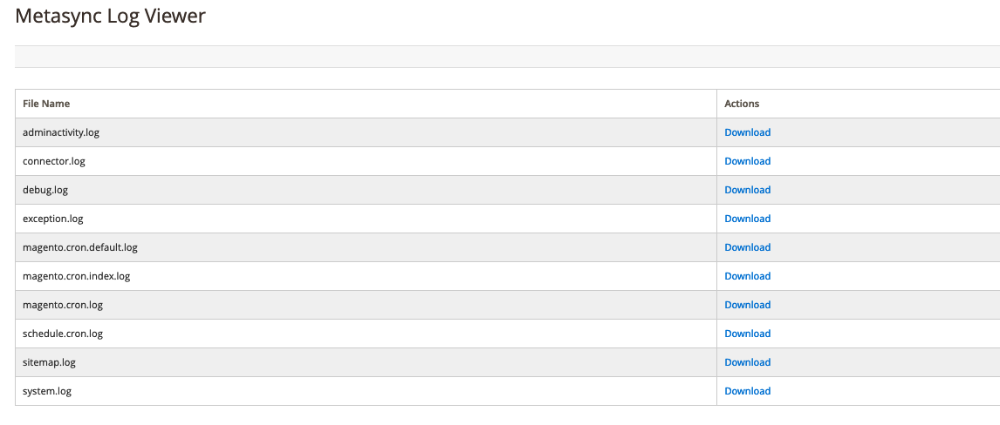

# Magento 2 : Log viewer
## Display log file information in an admin grid

### About
- This module tested on magento 2.2 but can work with magento 2.3, 2.4
- You can easily download log file from server for check logs.

### Setup
- move Metasync folder to - `app/code/`
- `bin/magento set:up`
- `bin/magento ca:fl`
- admin path -> System - Metasync Log Viewer

